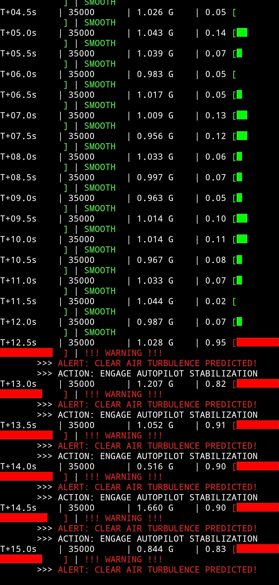

# ASTRIA-CAT: Predictive Clear-Air Turbulence (CAT) Detection
### ✈️ AI-Powered "Smart Skin" for Next-Gen Avionics


> **Focus:** Aeronautical Safety / Edge Computing  
> **Method:** Distributed Pressure Sensing & 1D-CNN Inference

---

## 📋 Project Overview
Clear-Air Turbulence (CAT) is invisible to conventional radar and remains a leading cause of in-flight injuries. **ASTRIA-CAT** proposes a paradigm shift: instead of relying on remote sensing, the aircraft uses a distributed array of MEMS pressure sensors ("Smart Skin") to detect the micro-scale aerodynamic precursors of turbulence **before the main jolt occurs**.

This repository hosts the **Real-Time Simulation Testbed**, demonstrating how an onboard Edge AI processor can analyze sensor streams and trigger autonomous alerts in milliseconds.

---

## 🚀 Key Features

### 1. "Smart Skin" Sensor Fusion
- Simulates a distributed array of high-frequency MEMS pressure sensors.
- Detects subtle **Kelvin-Helmholtz Instability (KHI)** waves, which are physical precursors to severe turbulence.

### 2. Edge AI Inference
- Deploys a lightweight **1D-Convolutional Neural Network (1D-CNN)** optimized for embedded flight computers.
- **Latency:** < 60 ms inference time (Verified).
- **Privacy:** All data is processed locally onboard; no cloud dependency.

---

## 📊 Live Simulation Results

The system was tested using a "Turbulence Injection" scenario. As shown below, the Flight Computer successfully identifies the transition from *Laminar Flow* to *Turbulent Flow* and triggers a **CAT WARNING**.

### 📸 Flight Computer Output (Terminal View)

*> Fig 1. Real-time telemetry log showing the AI model detecting a turbulence event (Probability > 85%) and triggering an automated alert.*

---

## 🛠️ Repository Structure

```bash
ASTRIA-CAT/
├── src/
│   └── cat_testbed.py       # [NEW] Flight Computer Simulation Script
├── data/                    # Synthetic Pressure Datasets
├── results/                 # Performance Graphs & Screenshots
└── Dissertation.pdf         # Full Research Paper
<div align="center">

[](./ASTRIA_CAT_Dissertation_2026_Simulation_Verified.pdf)

</div>

